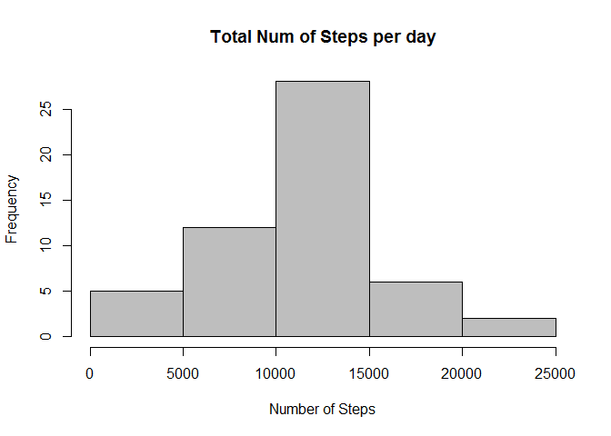
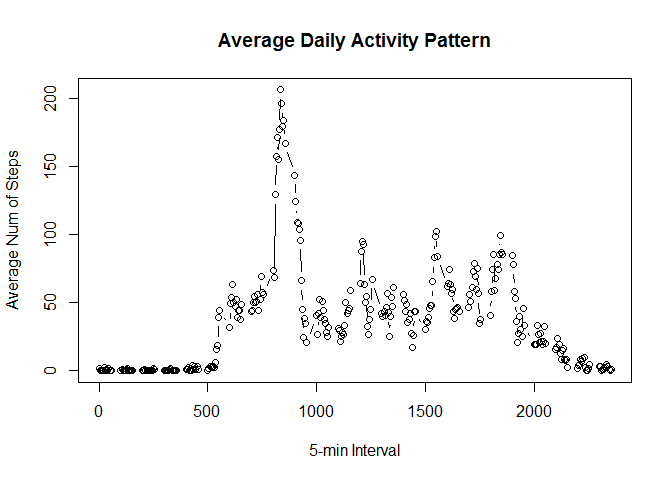
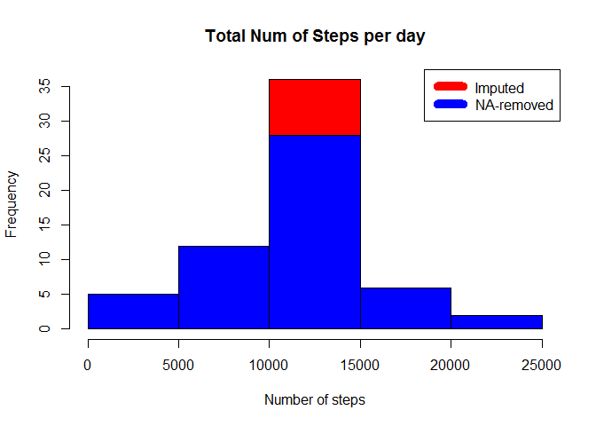
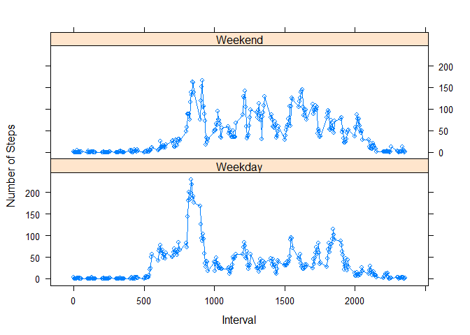

# Reproducible Research: Peer Assessment 1

#Loading and preprocessing the data


```r
#Load csv file
Activity_Data <- read.table("activity.csv", sep=",", header = TRUE, colClasses =c("numeric", "Date", "numeric"))
#Removes NA values
Activity_Data_noNA <- na.omit(Activity_Data)
```

#What is mean total number of steps taken per day?

Sum steps by day, create Histogram, and calculate mean and median.


```r
# aggregate data for histogra (sum of steps per day)
Steps_Sum <- aggregate(steps ~ date, Activity_Data_noNA, sum)
# create histogram
hist(Steps_Sum$steps, main="Total Num of Steps per day", col="grey", xlab="Number of Steps")
```

 

```r
# calculate mean steps per day
steps_mean <- mean(Steps_Sum$steps)
print(sprintf("Mean total steps taken per day: %f ", steps_mean))
```

```
## [1] "Mean total steps taken per day: 10766.188679 "
```

```r
# calculate median steps per day
steps_median <- median(Steps_Sum$steps)
print(sprintf("Median total steps taken per day: %f ", steps_median))
```

```
## [1] "Median total steps taken per day: 10765.000000 "
```

#What is the average daily activity pattern ?

1) Calculate average steps for each interval for all days.
2) Plot the Average Number Steps per Day by Interval.
3) Find interval with most average steps.


```r
# aggregate data for plot (mean steps for each interval)
Steps_interval_mean <- aggregate(steps ~ interval, Activity_Data_noNA, mean)
# create plot
plot(Steps_interval_mean$interval, Steps_interval_mean$steps, type = "b", xlab = "5-min Interval", ylab = "Average Num of Steps", main = "Average Daily Activity Pattern")
```

 

```r
# interval with most average steps
maxavginterval = Steps_interval_mean$interval[Steps_interval_mean$steps == max(Steps_interval_mean$steps)]
```

The interval (over all days) containing the maximum number of steps is `835`.

#Impute missing values and compare imputed data set to non-imputed data set.

Strategy: Replace NA step values for corresponding intervals with mean interval values


```r
# sum total NAs in steps
Count_NA <- sum(is.na(Activity_Data$steps))
print(sprintf("Sum of all NA values for steps: %f ", Count_NA))
```

```
## [1] "Sum of all NA values for steps: 2304.000000 "
```

```r
# aggregate data for imputing
Steps_interval_mean <- aggregate(steps ~ interval, data = Activity_Data, FUN = mean)
# function for imputing
fillNA <- numeric()
for (i in 1:nrow(Activity_Data)) {
        x <- Activity_Data[i, ]
        if (is.na(x$steps)) {
                steps <- subset(Steps_interval_mean, interval == x$interval)$steps
        } else {
                steps <- x$steps
        }
        fillNA <- c(fillNA, steps)
}
# create new data set
New_Activity_Data <- Activity_Data
New_Activity_Data$steps <- fillNA
# create combined histogram
New_Activity_Steps_Imputed <- aggregate(steps ~ date, New_Activity_Data, sum)
hist(New_Activity_Steps_Imputed$steps, col="red", main="Total Num of Steps per day", xlab="Number of steps")
hist(Steps_Sum$steps, main="Total Num of Steps per day", col="blue", xlab="Number of Steps", add=T)
legend("topright", c("Imputed", "NA-removed"), col=c("red", "blue"), lwd=10)
```

 

```r
# calculate mean steps per day imputed for comparison with non imputed data set
steps_mean_imputed <- mean(New_Activity_Steps_Imputed$steps)
print(sprintf("Mean total steps taken per da (imputed)y: %f ", steps_mean_imputed))
```

```
## [1] "Mean total steps taken per da (imputed)y: 10766.188679 "
```

```r
# calculate median steps per day imputed for comparison with non imputed data set
steps_median_imputed <- median(New_Activity_Steps_Imputed$steps)
print(sprintf("Median total steps taken per da (imputed)y: %f ", steps_median_imputed))
```

```
## [1] "Median total steps taken per da (imputed)y: 10766.188679 "
```

#Are there differences in activity patternsbetween weekdays and weekends?


```r
# get weekdays of date
day <- weekdays(New_Activity_Data$date)
# function to determine if found day belongs to weekend or to weekday
daylevel <- vector()
for (i in 1:nrow(New_Activity_Data)) {
        if (day[i] == "Samstag") {
                daylevel[i] <- "Weekend"
        } else if (day[i] == "Sonntag") {
                daylevel[i] <- "Weekend"
        } else {
                daylevel[i] <- "Weekday"
        }
}
# create new column daylevel indicating weekend or weekday
New_Activity_Data$daylevel <- daylevel
# transform into factors with two levels "weekend" and "weekday"
New_Activity_Data$daylevel <- factor(New_Activity_Data$daylevel)
# aggregate data set for xyplot
stepsByDay <- aggregate(steps ~ interval + daylevel, data = New_Activity_Data, mean)
names(stepsByDay) <- c("interval", "daylevel", "steps")
# create xy (lattice) plot
library(lattice)
```

```
## Warning: package 'lattice' was built under R version 3.1.3
```

```r
xyplot(steps ~ interval | daylevel, stepsByDay, type = "b", layout = c(1, 2), 
       xlab = "Interval", ylab = "Number of Steps")
```

 
